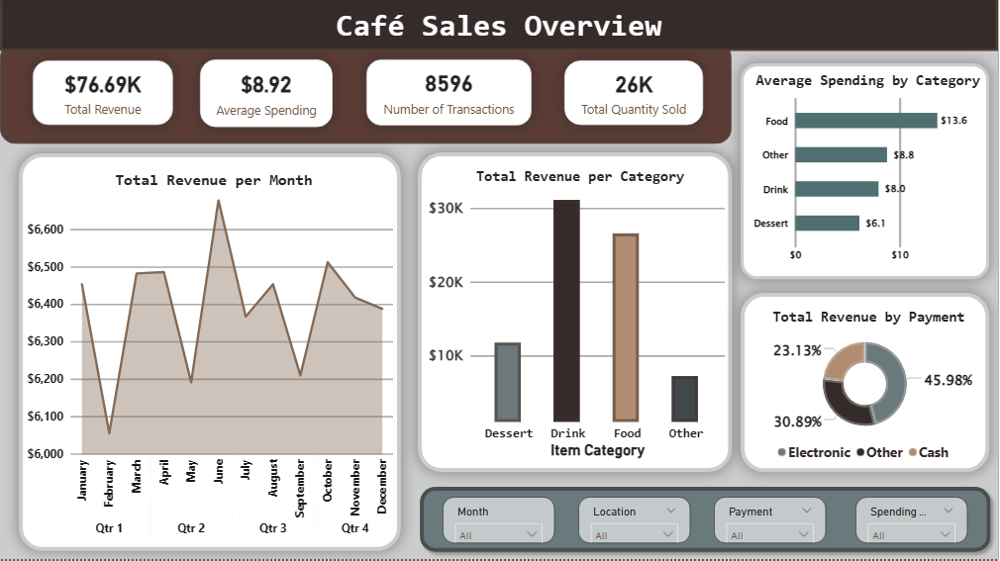
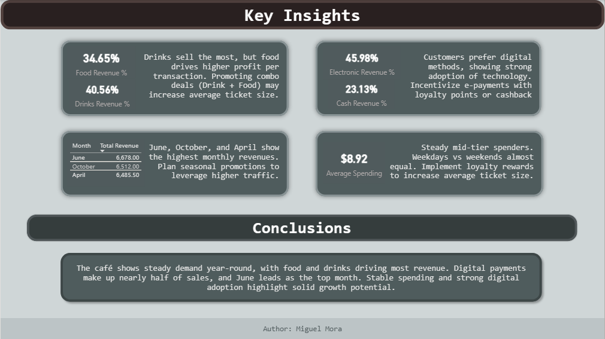

# Café Sales Data Analysis — End-to-End BI Pipeline

In the competitive food and beverage industry, data-driven decisions are the key to optimizing inventory and increasing profitability. This project demonstrates a complete Business Intelligence workflow: transforming raw, inconsistent café transaction data into a high-impact interactive dashboard.

The pipeline leverages **MySQL** for robust data engineering (cleaning, validation, and feature engineering) and **Power BI** for advanced data visualization and trend analysis.

---

## Project Gallery

**Executive Sales Dashboard**
*An interactive Power BI report showcasing revenue trends, product performance, and customer spending patterns.*

---

## Table of Contents
- [Overview](#overview)
- [Features](#features)
- [Tools Used](#tools-used)
- [Data Cleaning Process](#data-cleaning-process)
- [Feature Engineering](#feature-engineering)
- [Insights & Results](#insights--results)
- [Conclusions](#conclusions)

---

## Overview
This project focuses on analyzing café sales data to uncover trends and customer behavior. The goal was to transform a dataset with missing values and inconsistencies into a reliable source of truth. By combining SQL for the "heavy lifting" of data prep and Power BI for the final presentation, the project delivers actionable business insights.

## Features
- **Comprehensive Cleaning:** Removal of duplicates, normalization of naming conventions, and handling of null/invalid values.
- **Financial Validation:** Recalculation of total spending and price audits to ensure accounting accuracy.
- **Temporal Analysis:** Transformation of raw timestamps into granular time dimensions (Month, Day, Weekday/Weekend).
- **Advanced Categorization:** Logic-driven grouping of products and payment methods for better reporting.

## Tools Used
- **MySQL:** Data extraction, cleaning, and transformation (ETL).
- **Power BI:** Data modeling, DAX measures, and interactive visualization.
- **Dataset:** Adapted from Kaggle (Café transaction records).

## Data Cleaning Process
To move from raw data to a reliable dataset, the following SQL strategy was implemented:
* **Deduplication:** Identified and removed duplicate records based on unique Transaction IDs.
* **Standardization:** Converted column names to lowercase underscore format for cross-platform compatibility.
* **Numeric Audit:** Recalculated `total_spent` fields and removed records with non-positive values in quantity or price.
* **Handling Inconsistencies:** Replaced "UNKNOWN" or "ERROR" entries with standardized NULL placeholders.
* **Date Formatting:** Converted string-based timestamps into proper Date objects to enable time-series analysis.

## Feature Engineering
Several analytical columns were engineered in SQL to add layers to the analysis:
* **item_category:** Classified products into *Drink*, *Food*, or *Dessert*.
* **payment_type:** Grouped various methods into *Electronic* or *Cash*.
* **spending_category:** Segmented transactions into *Low*, *Medium*, or *High* based on value.
* **Temporal Dimensions:** Added `day_type` (Weekday vs. Weekend) and `transaction_month` for seasonal trend tracking.

## Insights & Results
* **Product Performance:** Drinks are the volume leaders, but food items generate a significantly higher average ticket value.
* **Payment Trends:** Electronic payments (Credit Card/Digital Wallets) are dominant, suggesting a tech-savvy customer base.
* **Temporal Patterns:** Weekends drive higher-value "treat" transactions, while weekdays provide steady, consistent traffic.
* **Seasonality:** Identified specific months with peak sales, highlighting the ideal timing for marketing campaigns.

## Conclusions
The project highlights the critical importance of structured data preparation. **SQL** ensured that the insights were built on a foundation of accurate data, while **Power BI** turned those numbers into a story. These results provide a roadmap for the café to optimize pricing, staff scheduling, and promotional timing.

---

*Thanks for reading!*
